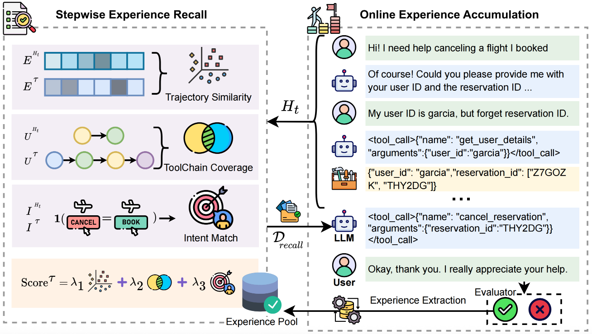

# SEER: Self-Guided Function Calling in LLMs via Stepwise Experience Recall

This repository contains the official implementation of **SEER (Stepwise ExperiencE Recall)**, accepted at **EMNLP 2025**.
SEER is a self-guided framework that enhances multi-step tool-use in large language models (LLMs) through **stepwise retrieval of past successful trajectories** and **continual experience accumulation**.

* 📄 Paper: *Self-Guided Function Calling in Large Language Models via Stepwise Experience Recall* (EMNLP 2025)
* 🎯 Benchmarks: ToolQA, τ-bench
* 🧩 Core Idea: Dynamically retrieve task-relevant exemplars from an online experience pool to guide LLM function calling.

<p align="center">
  
</p>

---

## 🔑 Key Features

* **Stepwise Experience Recall**: Fine-grained retrieval based on **trajectory similarity**, **toolchain coverage**, and **intent alignment**.
* **Continual Experience Accumulation**: Automatically adds successful trajectories to the experience pool for self-improvement.
* **Tool-Augmented LLMs**: Supports SQL, Python, math, text retrieval, and graph tools.
* **Extensive Evaluation**: Achieves +6.1% (easy) and +4.7% (hard) improvement on ToolQA, with strong gains on τ-bench.

---

## 📂 Repository Structure

```
.
├── data/                 # Datasets and question sets
│   ├── dataset_generation/   # Notebooks for generating ToolQA variants
│   │   ├── easy_questions/   # Easy question generation
│   │   └── hard_questions/   # Hard question generation
│   └── questions/            # JSONL question files (easy & hard)
│
├── plot/                 # Scripts & figures for analysis and ablations
│   ├── ablation.py
│   ├── improvement.py
│   └── *.pdf / *.html
│
├── seer/                 # Core implementation of SEER
│   ├── llm_agents.py         # LLM agent interface
│   ├── llm_evaluator.py      # LLM-as-a-judge evaluator
│   ├── fewshots.py           # Few-shot example manager
│   ├── tdqa*.py              # ToolQA experiment entry points
│   ├── prompt_library/       # Prompt selection (Recall) & embeddings
│   ├── tools/                # Tool wrappers (SQL, Python, Math, Text, Graph, Table)
│   ├── utils.py              # Utility functions
│   └── configs.json          # Experiment configs
│
├── requirements_pip.txt   # Pip dependencies
├── requirements_conda.yaml# Conda environment
└── README.md
```

---

## ⚙️ Installation

We recommend using **conda**:

```bash
conda env create -f requirements_conda.yaml
conda activate seer
```

Alternatively, with pip:

```bash
pip install -r requirements_pip.txt
```

---

## 🚀 Usage

```bash
python seer/tdqa.py
```

---

## 📊 Data

* **ToolQA** datasets are under `data/questions/` (easy & hard).
* Each domain (e.g., `airbnb`, `coffee`, `scirex`) has corresponding `.jsonl` files.
* **Dataset generation notebooks** (`data/dataset_generation/`) provide scripts to regenerate question sets.

---

## 📈 Results

SEER achieves strong performance improvements:

* **ToolQA**: +6.1% (easy) and +4.7% (hard) vs. strongest baseline
* **τ-bench**: Qwen2.5-72B + SEER reaches **51.84%**, approaching GPT-4o (54.76%).

For detailed numbers, see the paper and `plot/` folder.

---

## 📚 Citation

If you find this code useful, please cite our paper:

```bibtex
@article{cui2025self,
  title={Self-Guided Function Calling in Large Language Models via Stepwise Experience Recall},
  author={Cui, Sijia and He, Aiyao and Xu, Shuai and Zhang, Hongming and Wang, Yanna and Zhang, Qingyang and Wang, Yajing and Xu, Bo},
  journal={arXiv preprint arXiv:2508.15214},
  year={2025}
}
```
